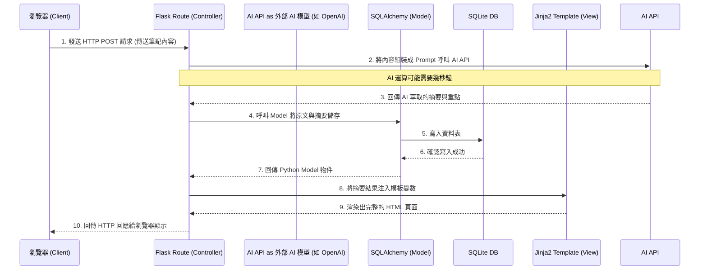

# 系統架構文件 (Architecture) - 個人 AI 學習助理系統

## 1. 技術架構說明

本系統為輕量級的單體式網頁應用程式 (Monolithic Web Application)，採傳統的伺服器端渲染 (Server-Side Rendering, SSR) 模式，並與第三方 AI API 服務進行整合。

### 選用技術與原因
- **後端框架：Python + Flask**
  - **原因**：Flask 是輕量彈性的微框架，無太多預設限制，非常適合快速開發與驗證 MVP 產品。再者，Python 在處理 AI、自然語言任務時具備極大的優勢與豐富生態 (如 OpenAI SDK 等)，便於後續與大語言模型無縫整合。
- **模板引擎：Jinja2**
  - **原因**：Flask 內建支援且整合極佳，能直接將後端的資料傳遞到前端 HTML 中渲染。適合不需要複雜前端狀態管理（如 React/Vue）的中小型網頁架構，開發速度快且直覺。
- **資料庫：SQLite (搭配 SQLAlchemy ORM)**
  - **原因**：對於初期的系統與 MVP，SQLite 不需額外架設資料庫伺服器，檔案即資料庫，方便部署與本地測試。配合 SQLAlchemy ORM（物件關聯對映），我們能以 Python 類別與物件的方式操作資料庫，提升開發效率且防止基本的 SQL 注入風險。

### Flask MVC 模式說明
本專案的架構設計依循類 MVC (Model-View-Controller) 的職責分離模式：
- **Model (模型)**：位於 `app/models/`，負責定義資料結構 (如使用者、筆記、測驗、錯題庫) 以及操作 SQLite 資料庫的核心邏輯。
- **View (視圖)**：位於 `app/templates/`，由 Jinja2 模板與 HTML/CSS 構成，負責接收從 Controller 傳來的動態資料並呈現為使用者可見的 UI 介面。
- **Controller (控制器)**：位於 `app/routes/`，負責接收從瀏覽器發出的 HTTP 請求，處理商業邏輯（例如調用 AI 服務產生摘要、存取資料庫 Model 等），最後決定要回傳哪個 View 給使用者。

---

## 2. 專案資料夾結構

本系統將採用模組化的結構來分離關注點：

```text
web_app_development2/
├── app/                      ← 應用程式主目錄 (核心邏輯)
│   ├── __init__.py           ← Flask App 初始化與套件設定 (如 DB 實例與 Blueprints 註冊)
│   ├── models/               ← 資料庫模型 (Model)
│   │   ├── user.py           ← 使用者帳號與權限模型
│   │   ├── note.py           ← 筆記與重點摘要模型
│   │   ├── quiz.py           ← 測驗與錯題紀錄模型
│   │   └── plan.py           ← 學習計畫模型
│   ├── routes/               ← 路由控制器 (Controller - Flask Blueprints)
│   │   ├── auth.py           ← 註冊、登入與會話管理
│   │   ├── note_routes.py    ← 筆記上傳與 AI 摘要路由
│   │   ├── quiz_routes.py    ← AI 自動出題與測驗結果路由
│   │   ├── plan_routes.py    ← 學習計畫追蹤路由
│   │   └── chat_routes.py    ← 語音/對話式解題輔助路由
│   ├── templates/            ← HTML 模板頁面 (View - Jinja2)
│   │   ├── base.html         ← 基礎共用版型 (包含導覽列、頁首、頁尾)
│   │   ├── index.html        ← 首頁 / 使用者儀表板 (進度視覺化)
│   │   ├── auth/...          ← 會員相關頁面
│   │   ├── notes/...         ← 筆記上傳與摘要展示頁面
│   │   └── quizes/...        ← 答題與錯題本頁面
│   └── static/               ← 靜態資源檔案
│       ├── css/style.css     ← 共用樣式與排版設定
│       └── js/main.js        ← 前端輕量互動邏輯 (如圖表 Chart.js 繪製、非同步 Loading 處理)
├── instance/                 ← 存放具機密性或運行時產生的檔案
│   └── database.db           ← SQLite 資料庫實體檔案
├── docs/                     ← 專案文件
│   ├── PRD.md                ← 產品需求文件
│   └── ARCHITECTURE.md       ← 系統架構文件 (本文)
├── requirements.txt          ← Python 套件相依清單
├── .env                      ← 環境變數設定 (開發用，不上 Git)
└── app.py                    ← 專案入口點 (啟動開發伺服器)
```

---

## 3. 元件關係圖

以下展示當使用者透過瀏覽器操作某項 AI 功能 (例如產生筆記摘要) 時，系統內部各元件之間的資料流與互動順序：



---

## 4. 關鍵設計決策

1. **採用藍圖 (Flask Blueprints) 進行功能拆分**
   - **考量**：系統涵蓋筆記整理、智能測驗、對話輔助等多項模組。如果將所有視圖函數寫在 `app.py` 中會使得程式碼極度難以維護。因此決定使用 Blueprints 按照功能 (如 `auth`, `notes`, `quizes` 等) 將控制器拆分到 `app/routes/` 下，確保模組獨立性與可擴展性。

2. **嚴格的 Server-Side Rendering (SSR) 邊界控制**
   - **考量**：「學習圖表視覺化」與「AI 對話功能」若全依賴後端重整頁面，使用者體驗會大打折扣。因此決策是：**主要頁面跳轉與資料送出由 Flask 路由處理**，但對於「非同步 AI 回覆狀態 (Loading)」與「圖表繪製」，我們會適度地在 `static/js` 中結合 原生 JavaScript (Fetch API) 與 Chart 套件處理局部性的渲染更新。

3. **封裝 AI 服務層**
   - **考量**：由於依賴外部 AI API，其回應格式、網路錯誤處理與 Prompt 管理是變動性最大的區域。未來我們會在專案中抽離一個 `app/services/ai_service.py` (雖未在目錄樹窮舉，但屬控制器邏輯的一環)，不讓 Controller 直接包含大量的 HTTP Request 到 OpenAI，以增加可測試性與替換不同語言模型彈性。

4. **抽離環境變數檔管理機密資訊**
   - **考量**：由於必須調用 AI 功能的 API Key，或者 Flask 所需要的 `SECRET_KEY`，我們強制使用 `python-dotenv` 來管理這些敏感鍵值。確保 `.env` 不會提交至 Git，同時建立 `.env.example` 給其他開發者參考環境設置。
