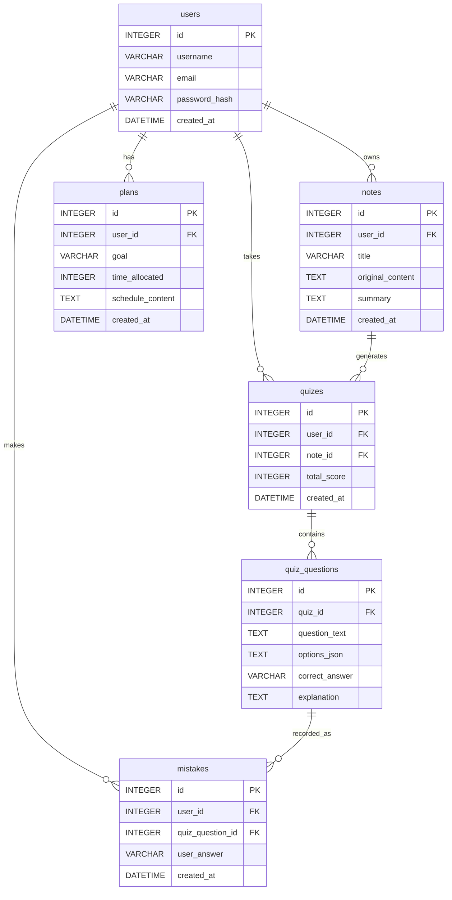

# 資料庫設計文件 (DB Design) - 個人 AI 學習助理系統

## 1. ER 圖

## 2. 資料表詳細說明

### 2.1. users (使用者)
負責儲存使用者的基本資料與登入認證。
- `id` (INTEGER): PK，主鍵
- `username` (VARCHAR(50)): 必填，使用者暱稱
- `email` (VARCHAR(120)): 必填且唯一，登入用信箱
- `password_hash` (VARCHAR(128)): 必填，加密後的密碼
- `created_at` (DATETIME): 帳號建立時間

### 2.2. notes (筆記)
儲存使用者上傳或輸入的學習筆記原文及 AI 產生的摘要。
- `id` (INTEGER): PK，主鍵
- `user_id` (INTEGER): FK，關聯至 `users.id`，必填
- `title` (VARCHAR(100)): 必填，筆記標題
- `original_content` (TEXT): 必填，使用者的原文筆記 
- `summary` (TEXT): AI 解析後產生的摘要內容
- `created_at` (DATETIME): 筆記建立時間

### 2.3. plans (學習計畫)
記錄系統為使用者產生的階段性學習計畫。
- `id` (INTEGER): PK，主鍵
- `user_id` (INTEGER): FK，關聯至 `users.id`，必填
- `goal` (VARCHAR(200)): 必填，該次學習的核心目標
- `time_allocated` (INTEGER): 必填，分配總時數 (分鐘)
- `schedule_content` (TEXT): 必填，AI 生成之計畫內容(以 JSON 陣列或格式化文字儲存)
- `created_at` (DATETIME): 計畫建立時間

### 2.4. quizes (測驗)
一次測驗的整體紀錄。一場測驗可包含多題。
- `id` (INTEGER): PK，主鍵
- `user_id` (INTEGER): FK，關聯至 `users.id`，必填
- `note_id` (INTEGER): FK，選填，若是由特定筆記生成的測驗會記錄關聯
- `total_score` (INTEGER): 測驗最後獲得的分數
- `created_at` (DATETIME): 測驗生成時間

### 2.5. quiz_questions (測驗題目)
儲存 AI 產出的獨立測驗題目與解答。
- `id` (INTEGER): PK，主鍵
- `quiz_id` (INTEGER): FK，關聯至 `quizes.id`，必填
- `question_text` (TEXT): 必填，題目內容
- `options_json` (TEXT): 必填，以 JSON 格式儲存選項陣列 (如 `["A", "B", "C", "D"]`)
- `correct_answer` (VARCHAR(200)): 必填，正確解答
- `explanation` (TEXT): AI 提供的正確解答詳解

### 2.6. mistakes (錯題紀錄)
紀錄使用者在測驗中答錯的題目，建立錯題本。
- `id` (INTEGER): PK，主鍵
- `user_id` (INTEGER): FK，關聯至 `users.id`，必填
- `quiz_question_id` (INTEGER): FK，關聯至 `quiz_questions.id`，錯的那一題
- `user_answer` (VARCHAR(200)): 必填，當下使用者的錯誤答案
- `created_at` (DATETIME): 錯題紀錄時間

## 3. SQL 建表與 Python Model 說明
- **SQL 建表語法**存放在：`database/schema.sql` 之中。
- **Python SQLAlchemy Model** 開發建立於 `app/models/` 資料夾下，並對應所有關聯與 CRUD 方法層裝。包含：
  - `user.py`: User 模型
  - `note.py`: Note 模型
  - `plan.py`: Plan 模型
  - `quiz.py`: Quiz, QuizQuestion, Mistake 模型
