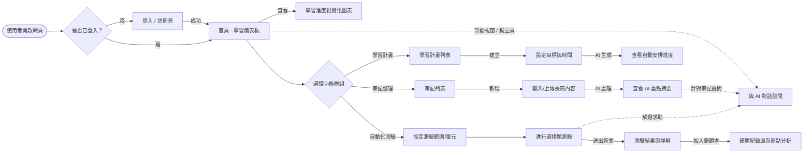
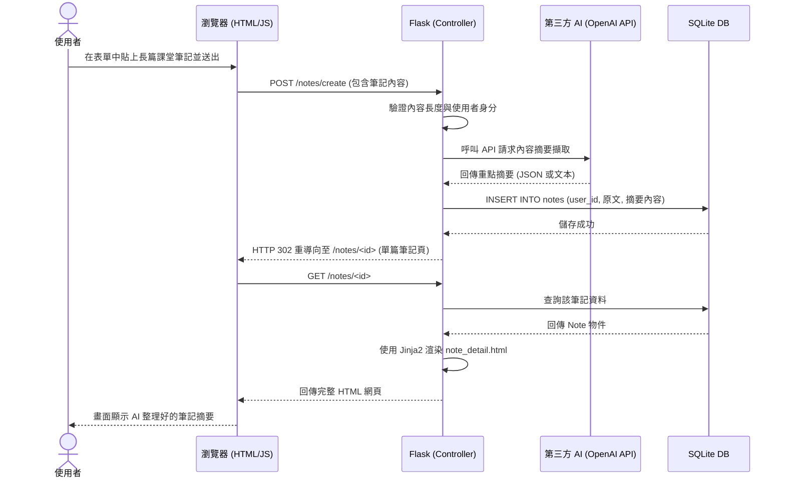

# 流程圖文件 (Flowchart) - 個人 AI 學習助理系統

本文件基於 PRD 與系統架構設計，視覺化「使用者如何操作系統」以及「內部資料如何流動」，並整理出 API 路由對應表。

## 1. 使用者流程圖 (User Flow)

此流程圖描述使用者從點擊進入網站，到使用各項核心功能的操作路徑。

## 2. 系統序列圖 (System Sequence Diagram)

此圖以「**使用者新增筆記並獲取 AI 摘要**」為例，展示前端、Flask 控制器、AI 服務以及資料庫之間的完整資料流向。

## 3. 功能清單對照表

根據上述功能需求，規劃 Flask 的 URL 路由、HTTP 方法及對應的操作：

| 功能模組 | 操作描述 | HTTP 方法 | URL 路徑 (Route) | 對應的樣板 (Template) |
| :--- | :--- | :--- | :--- | :--- |
| **首頁與授權** | 首頁 / 學習儀表板進度圖表 | GET | `/` | `index.html` |
| | 會員登入 | GET / POST | `/auth/login` | `auth/login.html` |
| | 會員註冊 | GET / POST | `/auth/register` | `auth/register.html` |
| | 會員登出 | GET | `/auth/logout` | 重導向至登入頁 |
| **AI 筆記整理** | 筆記列表 | GET | `/notes` | `notes/list.html` |
| | 新增筆記與產生摘要 | GET / POST | `/notes/create` | `notes/create.html` |
| | 查看單篇筆記與摘要 | GET | `/notes/<id>` | `notes/detail.html` |
| **智能學習計畫** | 計畫列表 | GET | `/plan` | `plans/list.html` |
| | 新增自訂學習目標與計畫 | GET / POST | `/plan/generate` | `plans/generate.html` |
| **自動出題與測驗** | 產生新測驗卷 | GET / POST | `/quiz/generate` | `quizes/generate.html` |
| | 進行測驗與送出答案 | GET / POST | `/quiz/<id>` | `quizes/take.html` |
| | 測驗結果 (含詳解) | GET | `/quiz/<id>/result` | `quizes/result.html` |
| | 錯題本與弱點追蹤 | GET | `/quiz/mistakes` | `quizes/mistakes.html` |
| **對話式輔助** | 語音/文字對話介面 | GET / POST | `/chat` | `chat/chat.html` |
